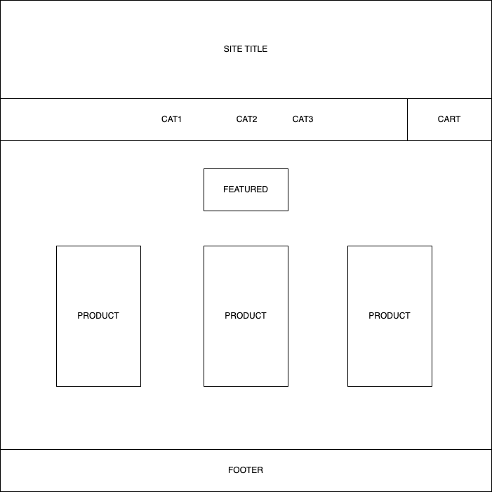
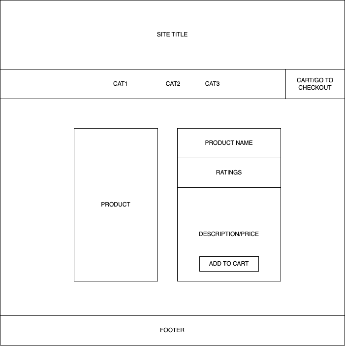
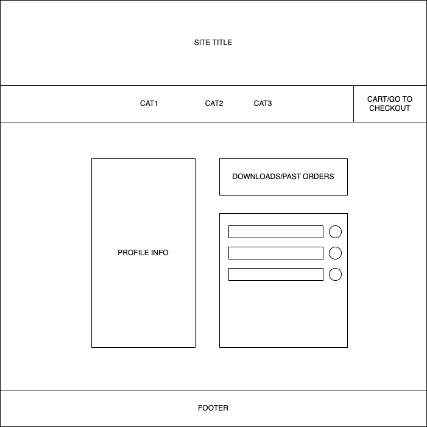
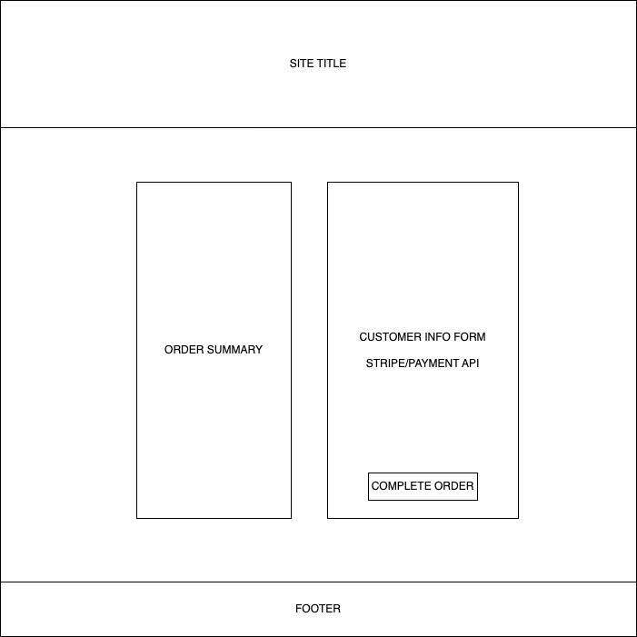
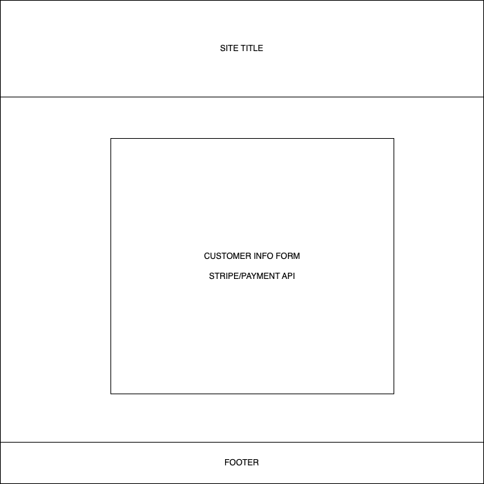
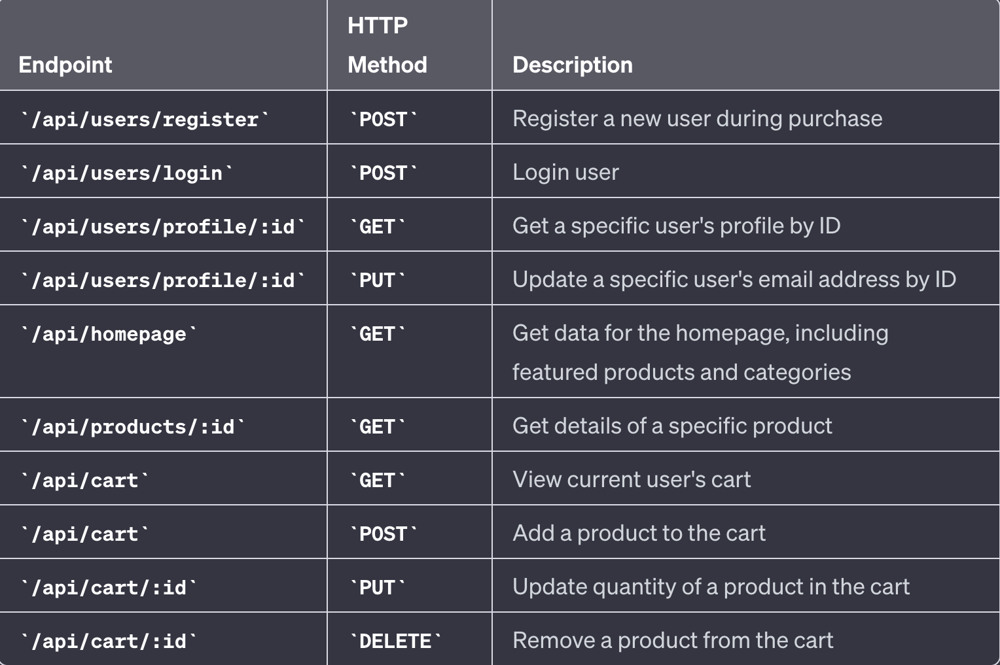

# Kingbird Audio Store

Kingbird Audio Store is an ecommerce store created in memory of my failed recording studio. It will sell the very things that were responsible for the studio's downfall: Presets and Templates to make recording from Home Studios sound good out of the box.

## Tech Stack

- Python
- Django
- React
- Stripe API

## MVP

- Build a fully functional ecommerce website to sell digital goods
- Allow users to have a list of their past orders to redownload at any time from their profile page
- Use payment API like Stripe or PayPal

## Stretch Goals

- Add audio demos of the products being used
- Add instructional page for how to implement/install
- Have cart persist if user leaves website and comes back

## Wireframes

## User Stories

- AAU I want to view and edit my shopping cart
- AAU I'd like to browse products by category
- AAU I'd like to hear demos of the products
- AAU I want to be able to download my files immediately
- AAU I'd like to see my old orders and be able to download old orders incase I lose the files

## ERD Chart

## Routing Chart

